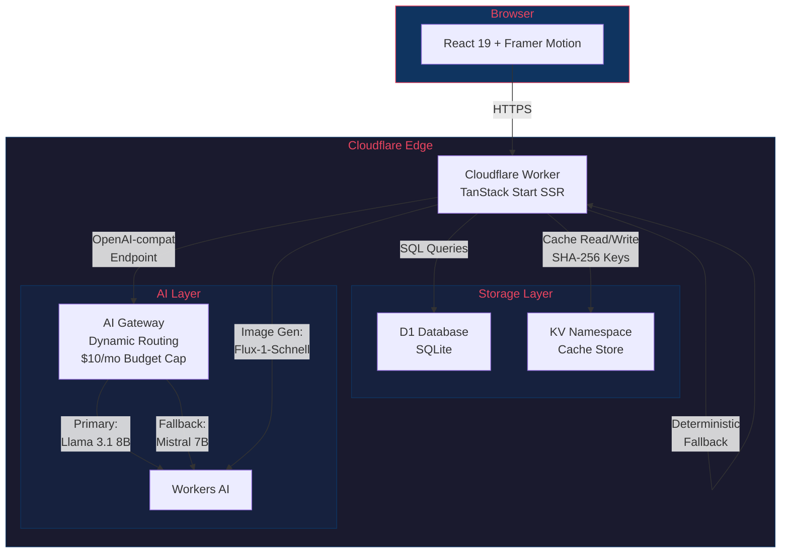
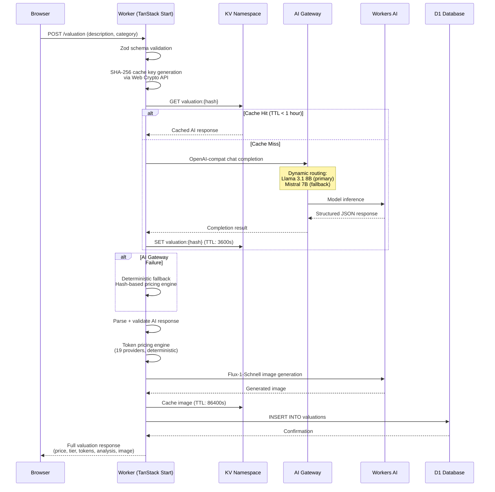
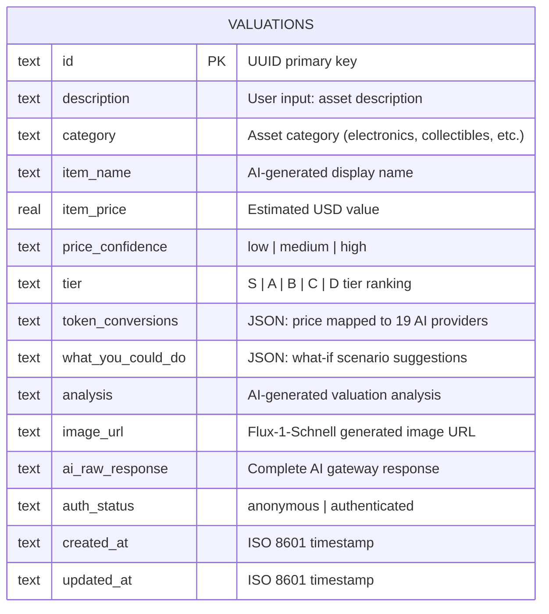
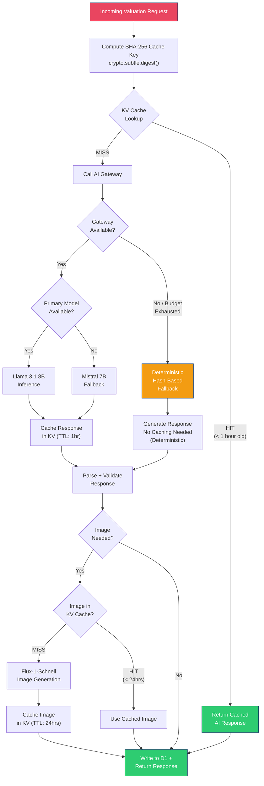

# Building Token For Granted: A Full-Stack Cloudflare Architecture Deep Dive

**How I built a Valorant-themed tactical asset valuation dashboard entirely on Cloudflare's edge -- and kept the bill under $10/month.**

Live at [tokenforgranted.com](https://tokenforgranted.com)

---

## Introduction

Token For Granted is a portfolio piece disguised as a product. It is a tactical asset valuation dashboard where users input tokens or assets and receive AI-powered valuations, "what if" scenarios, tier rankings, and a real-time tactical terminal console. The entire visual language is borrowed from Valorant's UI aesthetic -- what I call the "Neon Monolith" design system.

But the real story here is the infrastructure. The entire application runs on Cloudflare's stack: Workers for compute, D1 for persistence, KV for caching, AI Gateway for model orchestration, and Workers AI for inference. One `wrangler deploy` command ships everything. No containers. No Kubernetes. No cold starts worth worrying about.

This post walks through every architectural decision, every service integration, and every pattern I used to build a production-grade AI application on edge infrastructure -- with a deterministic fallback system that means the app never breaks, even when AI does.

---

## System Architecture Overview

The architecture follows a single-deployment edge model. Every request hits a Cloudflare Worker running TanStack Start with server-side rendering. That Worker has bindings to D1, KV, and Workers AI. AI Gateway sits as an intermediary proxy between the Worker and the AI models, handling routing, budgets, and observability.



What makes this architecture interesting is the layered resilience. If the AI Gateway is available, we get dynamic model routing with automatic fallback from Llama 3.1 8B to Mistral 7B. If the entire AI layer is down, a deterministic hash-based fallback generates consistent valuations with zero API calls. The user always gets a result.

---

## Request Lifecycle

Let's trace what happens when a user submits an asset for valuation. This is the critical path through the system, and it touches every Cloudflare service.



A few things to notice here. The cache check happens before any AI call -- identical inputs produce the same SHA-256 hash, so repeated valuations are served from KV in under 5ms at the edge. Image caching uses a longer 24-hour TTL since generated images are expensive and change less frequently than text valuations. And the entire flow, from request to response, executes in a single Worker invocation with no inter-service network hops outside the Cloudflare network.

---

## Cloudflare Services Deep Dive

### Workers + TanStack Start: The Compute Layer

The application uses TanStack Start (the full-stack framework from the TanStack ecosystem) running on Cloudflare Workers. This gives us React 19 with server-side rendering at the edge, server functions that run on Workers, and file-based routing with type-safe data loading.

The key architectural pattern here is server functions. TanStack Start's `createServerFn` compiles to Worker-side code that has direct access to Cloudflare bindings:

```typescript
export const createValuation = createServerFn({ method: 'POST' })
  .inputValidator(createValuationSchema) // Zod validation
  .handler(async ({ data }) => {
    // This runs on Cloudflare Workers
    // env.AI  -> Workers AI binding
    // env.DB  -> D1 database binding
    // env.KV  -> KV namespace binding
  })
```

This is important because it means no separate API server. The React components and the server logic deploy as a single Worker. The Vite build chain handles the split -- client components ship to the browser, server functions compile to Worker code. The `wrangler.jsonc` configuration wires up all the bindings:

```jsonc
{
  "d1_databases": [{ "binding": "DB", "database_name": "token-for-granted" }],
  "kv_namespaces": [{ "binding": "KV", "id": "..." }],
  "ai": { "binding": "AI" }
}
```

One `wrangler deploy` command takes the entire application from local dev to global edge deployment. No Docker. No CI pipeline required (though you should have one). The Worker runs in every Cloudflare data center worldwide, so a user in Tokyo gets the same latency characteristics as a user in Virginia.

### D1 Database: The Persistence Layer

D1 is Cloudflare's SQLite-at-the-edge database. For this project, it stores the canonical record of every valuation the system has produced. The schema is intentionally flat -- a single `valuations` table with JSON columns for nested data:

```sql
CREATE TABLE valuations (
    id          TEXT PRIMARY KEY,
    description TEXT NOT NULL,
    category    TEXT NOT NULL,
    item_name   TEXT,
    item_price  REAL,
    price_confidence TEXT,
    tier        TEXT,
    token_conversions TEXT,  -- JSON: price in tokens across 19 AI providers
    what_you_could_do TEXT, -- JSON: "what if" scenario suggestions
    analysis    TEXT,
    image_url   TEXT,
    ai_raw_response TEXT,   -- Full AI response for debugging
    auth_status TEXT DEFAULT 'anonymous',
    created_at  TEXT DEFAULT (datetime('now')),
    updated_at  TEXT DEFAULT (datetime('now'))
);
```

Why a single table? Because D1 is SQLite, and SQLite excels at simple schemas with JSON extraction. The `token_conversions` column stores a JSON object mapping provider names to token counts, and SQLite's `json_extract()` function handles any queries that need to reach into that structure. No ORM. No migrations framework beyond raw SQL files.

The `ai_raw_response` column is worth calling out. It stores the complete AI gateway response for every valuation. This is a debugging lifeline -- when the AI produces unexpected output, I can query the raw response to understand what the model actually returned versus what the parsing logic extracted. In production, this has saved hours of debugging time.

### KV Namespace: The Caching Layer

KV is the unsung hero of this architecture. It serves two distinct caching roles with different TTL strategies:

**AI Response Cache (1-hour TTL):** Before making any AI Gateway call, the system computes a SHA-256 hash of the input description and category, then checks KV for a cached response. The cache key generation uses the Web Crypto API, which is available natively in Workers:

```typescript
async function computeCacheKey(
  description: string,
  category: string
): Promise<string> {
  const input = `${description}|${category}`
  const hashBuffer = await crypto.subtle.digest(
    'SHA-256',
    new TextEncoder().encode(input)
  )
  const hashArray = Array.from(new Uint8Array(hashBuffer))
  const hashHex = hashArray.map(b => b.toString(16).padStart(2, '0')).join('')
  return `valuation:${hashHex}`
}
```

Why SHA-256 instead of a simpler hash? Two reasons. First, the Web Crypto API is hardware-accelerated on Workers, so SHA-256 is effectively free. Second, collision resistance matters when cache keys map to financial valuations -- a hash collision would serve the wrong valuation for the wrong asset.

The 1-hour TTL is a deliberate tradeoff. AI model outputs are probabilistic, so the same input can produce slightly different valuations over time. One hour is long enough to absorb repeated submissions (a user tweaking their query) but short enough that valuations stay reasonably fresh.

**Image Cache (24-hour TTL):** Generated images from Flux-1-Schnell are cached for 24 hours. Image generation is the most expensive operation in the pipeline (in terms of compute units consumed), and the visual representation of an asset doesn't need to change as frequently as its valuation analysis.

### AI Gateway: The Orchestration Layer

This is where the architecture gets interesting. Cloudflare's AI Gateway acts as a proxy between the Worker and the AI models, providing three critical capabilities: dynamic routing with fallback, budget enforcement, and request observability.

The Gateway is accessed via an OpenAI-compatible endpoint, which means I can use the standard OpenAI SDK:

```typescript
import OpenAI from 'openai'

function getGatewayClient(): OpenAI {
  return new OpenAI({
    apiKey: env.AI_GATEWAY_TOKEN,
    baseURL: `https://gateway.ai.cloudflare.com/v1/${env.CLOUDFLARE_ACCOUNT_ID}/${env.AI_GATEWAY_ID}/compat`,
  })
}
```

**Dynamic Routing** is configured in the AI Gateway dashboard. The primary model is `@cf/meta/llama-3.1-8b-instruct-fast` -- Meta's Llama 3.1 8B, optimized for fast inference on Cloudflare's hardware. If Llama fails (timeout, rate limit, model error), the Gateway automatically routes to `@cf/mistral/mistral-7b-instruct-v0.2` as a fallback. This happens transparently -- the Worker code doesn't know or care which model served the response.

**Budget Cap** is set at $10/month on the Gateway. This is a hard ceiling. When the budget is exhausted, the Gateway returns an error, and the Worker falls through to the deterministic fallback system (more on that below). For a portfolio project, this is essential -- I can share the live URL publicly without worrying about a surprise bill from a traffic spike.

**Observability** comes for free. Every request through the Gateway is logged with model, latency, token count, and cost. This has been invaluable for understanding real-world usage patterns and optimizing prompts for token efficiency.

### Workers AI: The Inference Layer

Workers AI provides two distinct capabilities in this application:

**Text Generation** for valuations uses the Llama 3.1 8B model (with Mistral 7B as fallback). The prompt engineering is structured to return valid JSON, including item name, price estimate, confidence level, tier ranking, analysis text, and "what if" scenario suggestions. The system prompt constrains the model to respond only with the expected JSON schema, which makes parsing reliable.

**Image Generation** uses Flux-1-Schnell (by Black Forest Labs) to create visual representations of valued assets. This runs through the Workers AI binding directly, not through the AI Gateway, since image generation doesn't benefit from the text model routing logic.

Both models run on Cloudflare's inference infrastructure, which means no external API calls, no egress charges, and inference latency measured in the low hundreds of milliseconds for text and a few seconds for images.

---

## The Deterministic Fallback Pattern

This is the pattern I'm most proud of in this architecture. The question it answers: what happens when AI is completely unavailable?

Most AI-powered applications just show an error. Token For Granted generates a plausible valuation using a deterministic, hash-based algorithm with zero API calls. Here is the principle:

1. **Hash the input.** The same SHA-256 hash used for caching also seeds the fallback pricing engine.
2. **Derive a price deterministically.** The hash bytes are mapped to a price range appropriate for the asset category. Same input always produces the same price.
3. **Generate consistent metadata.** Tier ranking, confidence level, and token conversions are all derived from the hash, so they remain internally consistent.

Why is this valuable? Because the user experience doesn't break. A user submitting "vintage mechanical keyboard" will always get the same fallback valuation, whether the AI is down for 5 minutes or 5 hours. The valuation is clearly marked as a deterministic estimate (not AI-generated), but the application remains fully functional.

This pattern is generalizable to any AI application where approximate results are better than no results. The key insight is that determinism from a good hash function produces outputs that feel random (and therefore plausible) while being perfectly reproducible.

---

## Token Pricing Engine

One of the more unusual features is the token conversion display. For every valued asset, the system shows how many AI tokens from various providers that asset's price would buy. This is a commentary on AI pricing -- "your vintage keyboard is worth 2.4 million GPT-4o tokens."

The pricing engine covers 19 AI providers and models with hardcoded per-token rates:

| Provider | Models | Pricing Basis |
|----------|--------|---------------|
| OpenAI | GPT-4o, 4o-mini, 4.1, 4.1-mini, 4.1-nano | Per 1M tokens (input) |
| Anthropic | Claude Opus 4, Sonnet 4, Haiku 3.5 | Per 1M tokens (input) |
| Google | Gemini 2.5 Pro, 2.5 Flash, 2.0 Flash | Per 1M tokens (input) |
| xAI | Grok 3, Grok 3 Mini | Per 1M tokens (input) |
| DeepSeek | V3, R1 | Per 1M tokens (input) |
| Meta | Llama 3.1 8B | Free tier reference |
| Mistral | Large, Small | Per 1M tokens (input) |
| Cohere | Command R+, Command R | Per 1M tokens (input) |

This is entirely deterministic -- no API calls to fetch pricing. The rates are hardcoded and updated manually. Why not fetch live pricing? Because pricing APIs are unreliable, change infrequently enough to not matter for a portfolio piece, and adding an external dependency would compromise the "runs entirely on Cloudflare" architecture.

The conversion is a simple division: `asset_price / price_per_token = token_count`. But it produces surprisingly engaging outputs. Users quickly grasp that their $150 headphones are worth 50 million Llama tokens but only 1 million GPT-4o tokens. It makes AI pricing tangible.

---

## Data Model

The data model is intentionally simple. A single table captures the complete valuation lifecycle:



A few design decisions worth explaining:

**No foreign keys or joins.** D1 is SQLite, and the application has a single entity type. There are no users table, no sessions table, no categories table. The `auth_status` field is a simple string rather than a foreign key to a users table because authentication is not the point of this project -- AI valuation is.

**JSON columns for nested data.** The `token_conversions` and `what_you_could_do` columns store JSON strings. In a PostgreSQL world, these would be JSONB columns with indexing. In D1/SQLite, they are TEXT columns that the application parses. This is fine because these fields are never queried directly -- they are always read as part of a full valuation record.

**Raw response storage.** The `ai_raw_response` column stores the complete, unparsed AI model response. This is a debugging and observability tool. When the parsed `analysis` field looks wrong, I can inspect the raw response to determine whether the issue is in the AI model's output or in the parsing logic.

---

## Caching Strategy

The caching layer has a specific decision tree that balances cost, freshness, and resilience:



**Key caching decisions:**

- **Why SHA-256 for cache keys?** Collision resistance matters when cache keys map to financial valuations. Web Crypto API makes SHA-256 hardware-accelerated and effectively free on Workers.
- **Why 1-hour TTL for text?** AI outputs are probabilistic. The same prompt can produce different valuations. One hour absorbs repeated queries while keeping results fresh enough.
- **Why 24-hour TTL for images?** Image generation is the most expensive operation. Visual representations of assets don't need hourly refreshes.
- **Why not cache deterministic fallbacks?** They are already deterministic -- the same input always produces the same output. Caching would add a KV read for no benefit.

---

## Design System: The Neon Monolith

The visual layer deserves its own section because it is central to the project's purpose as a portfolio piece. The design system is called "Neon Monolith" -- inspired by Valorant's tactical UI with a cyberpunk color palette.

**Core principles:**

- **No borders.** Tonal surface shifts define boundaries between regions. Instead of `border: 1px solid #333`, adjacent surfaces use subtle luminance differences (e.g., `bg-zinc-900` next to `bg-zinc-950`).
- **Space Grotesk for headlines.** A geometric sans-serif that evokes technical precision.
- **Inter for body text.** Optimized for screen readability at small sizes.
- **Neon accents on dark surfaces.** The primary accent color is a vibrant cyan/magenta that pops against near-black backgrounds.
- **Framer Motion everywhere.** Every state transition, every data load, every tier reveal is animated. Not gratuitously -- each animation serves a purpose (directing attention, indicating state change, creating spatial relationships).

**Tailwind CSS v4** powers the styling. The design tokens are defined as CSS custom properties and consumed through Tailwind's utility classes. This keeps the design system centralized while letting components compose styles declaratively.

The visual fidelity goal is pixel-perfect reproduction of screen designs created in Stitch (Google's prototyping tool). This means every padding value, every font weight, every color stop in a gradient was specified in advance and implemented exactly.

---

## Cost Analysis

One of the project's constraints is staying within Cloudflare's free and cheap tiers. Here is the actual cost breakdown:

| Service | Free Tier Allowance | Project Usage | Cost |
|---------|-------------------|---------------|------|
| Workers | 100K requests/day | Well under limit | $0 |
| D1 | 5M rows read/day, 100K writes/day | Minimal | $0 |
| KV | 100K reads/day, 1K writes/day | Moderate (caching helps) | $0 |
| Workers AI | Free tier varies by model | Primary compute cost | ~$0-5/mo |
| AI Gateway | Free (proxy layer) | All AI requests | $0 |
| Custom Domain | Cloudflare DNS (free) | tokenforgranted.com | $0* |

*Domain registration cost is separate from Cloudflare services.

**Total monthly Cloudflare cost: Under $10, enforced by AI Gateway budget cap.**

The caching strategy is the key cost optimization. Without KV caching, every repeated query would consume Workers AI compute units. With 1-hour TTL caching, the second through Nth identical query in any hour costs zero AI compute. For a portfolio project that might get shared on social media (bursty traffic, repeated queries from curious visitors), this is the difference between a $2 month and a $200 month.

The AI Gateway's $10/month budget cap is the safety net. If the project goes viral and cache misses spike, the Gateway stops routing to AI models when the budget is exhausted. The deterministic fallback takes over, and the application continues to work. The user gets a slightly different (deterministic vs. AI-generated) experience, but the application never goes down and the bill never exceeds $10.

---

## Architectural Decisions

| Decision | Choice | Rationale |
|----------|--------|-----------|
| Framework | TanStack Start | React 19 + SSR on Workers, server functions with native Cloudflare bindings, type-safe routing |
| Database | D1 (SQLite) | Single-table schema, no joins needed, deploys with `wrangler`, free tier is generous |
| Cache | KV Namespace | Edge-local reads, simple key-value model matches cache use case, TTL support built-in |
| AI Orchestration | AI Gateway | Dynamic routing, automatic fallback, budget caps, observability -- all without application code |
| Primary Model | Llama 3.1 8B | Best quality-to-speed ratio on Workers AI free tier, instruction-following is strong |
| Fallback Model | Mistral 7B | Different model family reduces correlated failures, good instruction-following |
| Image Model | Flux-1-Schnell | Fast generation, good quality for thumbnails, available on Workers AI |
| AI Client | OpenAI SDK | AI Gateway exposes an OpenAI-compat endpoint, reuse ecosystem tooling |
| Cache Keys | SHA-256 via Web Crypto | Hardware-accelerated on Workers, collision-resistant, deterministic |
| Token Pricing | Hardcoded rates | No external API dependency, rates change infrequently, keeps architecture self-contained |
| Fallback Strategy | Deterministic hash-based | App never breaks, consistent outputs, zero-cost when AI is unavailable |
| Styling | Tailwind CSS v4 | Design token integration, utility-first matches component architecture, v4 performance |
| Animations | Framer Motion | Declarative animations, layout transitions, gesture support for interactive elements |
| Validation | Zod | Runtime type checking on server functions, schema inference for TypeScript types |
| Deployment | Single `wrangler deploy` | One command, all services, global edge deployment |

---

## Conclusion

Token For Granted demonstrates that Cloudflare's stack is ready for non-trivial, AI-powered applications. The combination of Workers (compute), D1 (persistence), KV (caching), AI Gateway (orchestration), and Workers AI (inference) covers the full application lifecycle without leaving the platform.

The patterns that made this work:

1. **Server functions as the integration layer.** TanStack Start's `createServerFn` provides type-safe access to every Cloudflare binding. No glue code, no middleware.
2. **AI Gateway as a reliability multiplier.** Dynamic routing, automatic fallback, and budget caps are infrastructure concerns that should not live in application code. The Gateway handles all three.
3. **Deterministic fallbacks as a first-class feature.** The application is designed to work without AI from day one. AI makes it better; its absence doesn't make it broken.
4. **Aggressive caching with SHA-256 keys.** KV caching with content-addressed keys reduces AI compute costs by an order of magnitude for repeated queries.
5. **Single-command deployment.** The entire stack -- compute, storage, cache, AI -- deploys with `wrangler deploy`. This changes how you think about iteration speed.

The total cost of running this in production is under $10/month, enforced by a hard budget cap. The latency is sub-second for cached responses and under 3 seconds for AI-generated valuations. The application serves global traffic from every Cloudflare data center.

If you are evaluating Cloudflare's stack for your next AI application, I hope this deep dive gives you a concrete reference architecture. The code patterns are real, the cost numbers are real, and the tradeoffs are honestly documented.

Build something. Ship it to the edge. The infrastructure is ready.

---

*Token For Granted is a portfolio project by the author. The source code and design system are documented in the project repository. Built with TanStack Start, Cloudflare Workers, D1, KV, AI Gateway, and Workers AI.*
